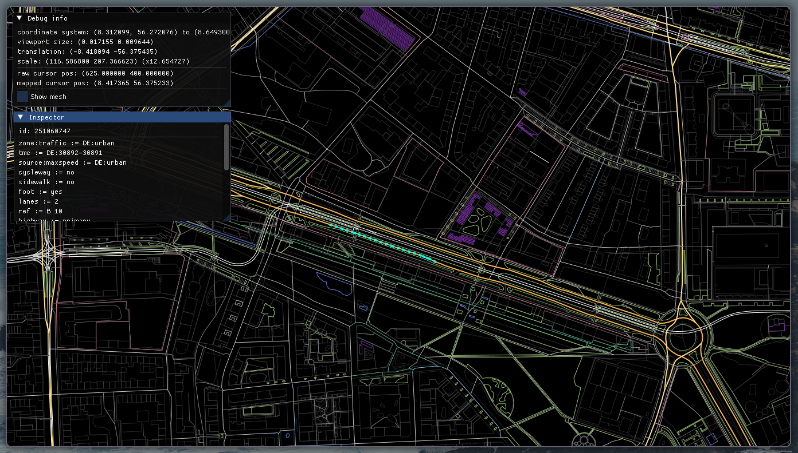

# OSM Map Viewer

An experimental map viewing application written in **C++** using `libexpat` and `OpenGL`.
This project is written for educational purposes to teach me how to manage large amounts of data.

## Current State



## Building

**Dependencies:**

- `libexpat`
- `glfw3`
- `glew`
- `glm`

Additionally, you need some sort of working C++ compiler

**Build Instructions:**

1. Clone the repository and enter its directory:

```sh
$ git clone https://github.com/spydr06/map --recursive
$ cd ./map
```

2. Compile the code

```sh
$ make
```

This produces the executable file `./build/map`

> [!NOTE]
> You can add custom compile flags by setting the `CXXFLAGS` environment variable:
> ```sh
> $ CXXFLAGS=-Ofast make
> ```

## Getting the Data

To use the application, you'll need to download the map you want to view as an `OSM XML` file.

This can be done on [extract.bbbike.org](https://extract.bbbike.org).

> [!IMPORTANT]
> The exported map area cannot be *too big*. Bigger maps currently result in significantly higher memory and vram usage and therefore lower performance.

## Usage

To use the application, invoke it with your `.osm` file from a terminal:

```sh
$ ./build/map <your OSM file>
```

## To-Do

- [ ] Split maps into chunks to support larger maps with acceptable performance
- [ ] Labels and icons in the map
- [ ] Better UI
- [ ] ...

------------------------

This project is licensed under the MIT License. See [LICENSE](./LICENSE) for more information.

